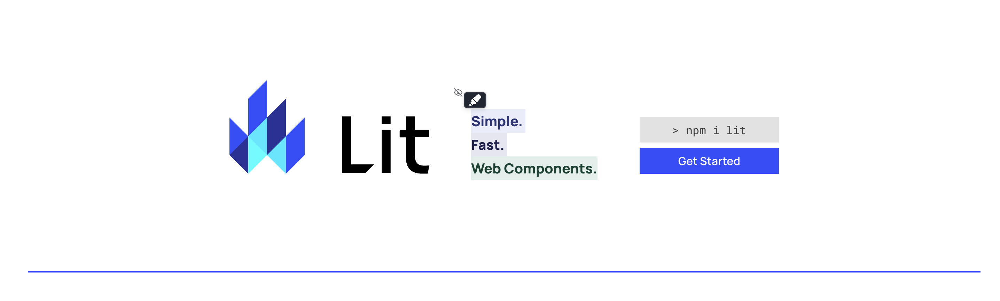

# Web Components Explore

### Lit

Lit is a simple library for building fast, lightweight web components.

```sh
https://lit.dev/docs/
```

### mdn web docs

```sh
https://developer.mozilla.org/en-US/docs/Web/API/Web_components
```



### Learn Web Components In 25 Minutes [Web Dev Simplified]

```sh
https://www.youtube.com/watch?v=2I7uX8m0Ta0
```

### Web Components Crash Course [Traversy Media]

```sh
https://www.youtube.com/watch?v=PCWaFLy3VUo
```
